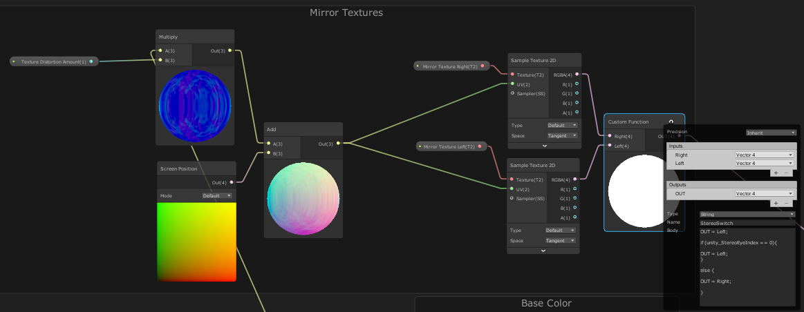

# UnityURPMirrorShader
https://www.reddit.com/r/Unity3D/comments/gjp2jw/mirror_shader_and_script_for_urp_that_works_for/
A mirror shader that works with VR in URP Unity Latest version (2019.3+), though only with multi-pass

I gathered the script from the unity forum and made adjustments so it works with VR and the new URP.

The shader is the culmination of a collection of youtube tutorials but its been a while so I can't remember where I got them from. Its made with shadergraph so feel free to play with it and adjust it in any way you like.

The bit that makes this work with VR is the most interesting and it done with a little custom function that I found on the unity forum and adjusted for what I need:
'''
OUT = Left;
if (unity_StereoEyeIndex == 0){
OUT = Left;
}
else {
OUT = Right;
}
'''

## How to use:
Place the script on the plane that will act as the mirror, make sure the shader has the textures with the correct names attached, an example shader is given.

This shader also includes some nice water flowing animations, in case you need those, but you can take these out pretty easily using shader graph by delecting the elements.
The textures/maps I used here are also included, so you can have a go at it yourself.

Let me know if something is broken and I will try to help you fix it :)

